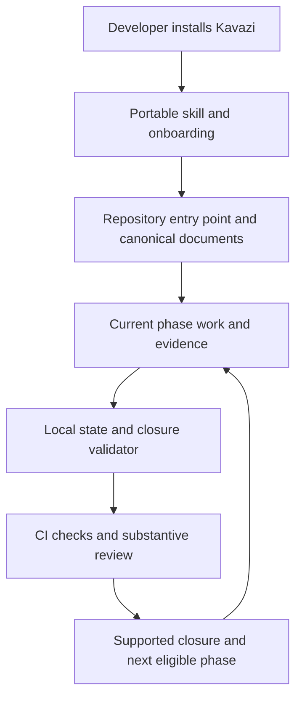

# Initial research proposal — archive

Archived during open-source preparation on 2026-10-09. This document records an earlier design and its observations; it does not govern current work. Read the [current Core](../../CORE_KAVAZI_METHOD.md) and [Master Implementation Plan](../MASTER_IMPLEMENTATION_PLAN.md) for the live method and sequence.

Former location: `PLAN.md`. Its pre-relocation SHA-256 was `8f6f288a481e881b1a17beb25eee0e423cbf146e3f51a734c19b4db938a763fd`. This archive adds this notice and repairs relative links; historical statements remain as recorded. A statement about missing tools or an undecided license describes that earlier point in development.

---

# Historical research proposal — Kavazi Method

Prepared 2026-10-09. This is a proposal for making the existing Kavazi skill useful to other developers. It defines the product and a high-level roadmap; it does not establish completed implementation phases or authorize publication.

This research snapshot preceded implementation. The live [Master Implementation Plan](../MASTER_IMPLEMENTATION_PLAN.md) and [Phase 01 evidence](../phases/phase-01/EVIDENCE.md) now govern status and record superseding observations.

The subsequent user revision adds captured input and [Master Technical Core](../MASTER_TECHNICAL_CORE.md), plus autonomous and human checkpoint modes. The earlier route and candidate interface below remain a dated research snapshot.

Build Kavazi as a portable agent skill with repository onboarding and a local validation tool. Developers should be able to install it, connect it to their existing repository, and give a new agent a verifiable route from product intent to the current task. CI should reject invalid phase transitions and unsupported closure records.

The promise is disciplined development with recoverable context and inspectable evidence. Strong wording in a prompt cannot guarantee agent obedience. Reliable adoption requires instructions, explicit state, automated checks, and substantive review working together.

## What Kavazi means

Kavazi connects five responsibilities in a canonical reasoning order:

**Core Method → Master Architecture → Master Methodology → Master Implementation Plan → current phase package.**

The architecture identifies technical owners and contracts. The methodology explains why an approach fits, what sources support it, and how to evaluate it. The master plan establishes stable development phases. Each eligible phase has an implementation plan, methodology, and running evidence record.

Work follows an empirical cycle: understand the wider outcome, separate observations from assumptions, choose a bounded change, check its effects, and reconcile the implementation and documents. The masters evolve when evidence changes; the method does not require designing the entire product before developing it.

Its distinctive constraints are:

- Only one created phase may be unfinished. Future direction remains a high-level roadmap; future detailed packages, including drafts stored elsewhere, wait until their predecessor closes.
- Every phase requires functional acceptance, a bug hunt and justified refactoring pass, verification, a fresh full-scope review, and documentation reconciliation before completion.
- Every fifth stable development phase also requires a whole-repository review. Reviewing only the latest diff or latest five phases is insufficient.
- Reviews repeat after fixes until the final fresh pass has no new actionable findings, prior findings are resolved, coverage is accounted for, and required checks pass. An unavailable required check keeps closure open.
- Refactoring needs a concrete reason and preserves accepted behavior. An inspected area with no justified refactor can be recorded without manufacturing code changes.
- Evidence records meaningful decisions and observations during development. Failed checks and superseded conclusions remain visible.
- Plans, source inspection, builds, tests, user observations, and release readiness support different claims. One cannot silently substitute for another.
- Context recovery starts at the Core, follows the canonical masters, and compares current phase evidence with the actual checkout.

These rules come from the existing [historical skill](original-skill.md) and theAgency's Core Method. Engine assumptions, game-design methods, repository paths, phase count, and model preferences belong to a project configuration, rather than the universal method.

## Current evidence and gaps

| Area | Observation on 2026-10-09 | Product implication |
|---|---|---|
| Existing package | This directory has `SKILL.md` and `agents/openai.yaml`; the skill already covers adoption, execution, recovery, and closure. | Preserve its rules and improve packaging and usability rather than inventing a replacement method. |
| Reference adoption | theAgency has a Core, canonical masters, an agent entry point, and a current three-document phase package. | Use it as a case study, separating reusable rules from project-specific content. |
| Existing checker | Its read-only validator returned `11 files, 142 local links, 1/11 phase packages/register entries, 0 errors` in this session. | There is reusable structural-checking experience, but this result establishes neither gameplay acceptance nor effectiveness across repositories. |
| Checker limits | It has fixed theAgency paths and Markdown parsing rules. It checks that review work items exist, rather than proving their execution or checking substantive closure evidence. | A portable validator needs path mapping, explicit state, and evidence-aware transition checks. |
| Distribution | No plugin manifest, installer, reusable templates, general validator, or CI integration is present in this directory. | The skill is a starting asset; the install-and-develop product remains to be built. |
| Packaging validation | The bundled skill validator could not run under the available Python interpreter because `yaml`/PyYAML is missing. | Record this as unavailable validation; do not repeat an old pass as a new result. |
| Workspace baseline | `git status` reports that this directory is not a Git repository, despite a protected `.git` directory. | Establish usable version control before implementation and release tracking. |

The existing skill is roughly 15 KB. Split conditional procedures into discoverable references while retaining the critical phase and closure constraints in the entry point. A shorter entry point is a context-cost hypothesis to evaluate, not proof that shorter instructions perform better.

## Who this should help

Start with developers using coding agents on an existing repository, especially when agents lose context, plans diverge from code, or completion claims lack evidence. Support new repositories through the same workflow, with a smaller initial architecture map.

An existing project needs an adoption baseline, not a fabricated history of completed Kavazi phases. Preserve its working code, accepted requirements, documents, historical results, and unfinished work. Map existing milestones explicitly; inherited code does not automatically satisfy acceptance.

Small fixes need a compact record within the active phase. A phase can be small, and routine edits can share one evidence entry. Keep closure rules intact while making record size proportional to the work. If a fix affects an earlier completed phase, record it in the active phase, link the affected history, and renew invalidated acceptance.

## The developer experience

Installation and repository adoption are distinct. Installing a skill makes the workflow available; adoption creates or reconciles the repository's own entry points and records.

The proposed experience is:

1. Install the versioned skill or plugin and request Kavazi adoption for a repository.
2. Inspect the repository, applicable agent instructions, existing documentation, current work, and available checks. Show the proposed mapping and changes before applying onboarding.
3. Apply the already-authorized onboarding changes: preserve existing canonical masters, add a small managed agent entry block, configure paths and checks, and create only the eligible current phase package.
4. Report the active phase, next action, required reading, available validation, and missing prerequisites.
5. Continue normal development. Every arriving agent can recover the same context and write evidence to the same current phase.
6. At closure, inspect the required evidence and reviews, run the applicable checks, reconcile the documents, and permit only the immediately next package when the predecessor fully closes.

The tool should make discrepancies concrete: “Phase 02 cannot be created: Phase 01 has no passing runtime check and its final review still has an open finding.” Avoid a generic “workflow invalid” message.

Candidate commands below illustrate the interface; none exists yet:

```text
kavazi init --repo . --dry-run
kavazi init --repo .
kavazi status --repo .
kavazi check --repo .
kavazi check --repo . --closure
kavazi doctor --repo .
```

`init` reconciles and installs the repository integration. `status` exposes the active phase and next action. `check` validates recorded structure and state; closure mode checks eligibility without automatically advancing. `doctor` explains installation, path, instruction-discovery, and prerequisite problems. Running configured project checks must be a distinct, visible execution action rather than a side effect of read-only inspection.

## Product architecture

Keep one provider-neutral rule set. Distribution packages and host adapters route agents to it; the local tool evaluates the same versioned protocol.



| Component | Responsibility | Boundary |
|---|---|---|
| Core protocol | Document responsibilities, phase lifecycle, evidence types, and clean-review conditions. | Stack- and provider-neutral; versioned with the tool. |
| Agent skill | Orient, frame, implement, observe, reconcile, and recover using the protocol. | Host instructions and user direction still govern authorization. |
| Onboarding | Discover the repository and reconcile its canonical documents and entry points. | Preserve existing content; ambiguous mappings remain explicit. |
| Local tool | Inspect installation, validate state and references, and evaluate transition eligibility. | A valid evidence record does not prove the recorded observation is true. |
| Repository integration | Managed instruction block, path/check configuration, structured phase records, and human-readable documents. | The repository owns product contracts and verification requirements. |
| CI integration | Run structural validation and configured executable checks against the candidate revision. | Actual merge enforcement depends on required checks and repository settings. |
| Host adapters | Supported discovery paths and small pointers to the canonical workflow. | Verify each host independently; installation on one does not establish another's support. |

Prefer a small Python tool with standard-library runtime dependencies for the initial implementation, reflecting the existing validator. Verify the supported Python version and Windows/macOS/Linux behavior before release. A hosted service or MCP server can follow if real usage demonstrates a need for shared remote state; local development should work without an account or uploading repository contents.

## Packaging and host support

Official OpenAI documentation distinguishes skill authoring from installable plugin distribution. Skills carry instructions and optional resources, and can be selected explicitly or implicitly. Use a concise description scoped to Kavazi requests and repositories that have adopted it. [Build skills](https://learn.chatgpt.com/docs/build-skills)

For distribution, use a root portable `plugin.json` and `skills/` directory. Add compatibility metadata only where the tested host requires it. OpenAI's current format also supports an onboarding skill through `extensions.com.openai.onboardingSkill`. [Package your plugin](https://developers.openai.com/plugins/build/plugins)

Proposed package layout:

```text
kavazi-method/
  plugin.json
  skills/
    kavazi-method/
      SKILL.md
      agents/openai.yaml
      references/         core rules and conditional procedures
      scripts/            local tool and validation
      assets/templates/   repository onboarding templates
    kavazi-setup/
      SKILL.md            plugin onboarding entry point
  tests/                  protocol, migration, and adoption fixtures
  README.md               developer installation and quick start
  LICENSE                 owner-selected distribution license
```

This is a packaging proposal, not a set of files to scaffold immediately. Keep one shared implementation of onboarding and validation; the setup skill should route to it. Standalone skill bundles must contain their needed resources without depending on sibling plugin files. Move the existing root skill into the selected release layout only when callers and installation paths are reconciled.

Start with Codex because the existing package includes its UI metadata. Its `AGENTS.md` discovery supports layered overrides, so onboarding must inspect applicable overrides and test from nested working directories. A root pointer alone may be insufficient. [Custom instructions with AGENTS.md](https://learn.chatgpt.com/docs/agent-configuration/agents-md)

Then evaluate Claude Code and Cursor adapters from their official documentation and real installation tests. Use the same protocol and provider-neutral skill content. Publish a support matrix distinguishing tested integrations from manual instructions and planned adapters.

Keep hooks optional. Current OpenAI documentation limits bundled lifecycle hooks to manually installed Codex desktop plugins and excludes hook-containing packages from the public directory. A distributable MVP should work through skills, local validation, and CI. [Bundled hooks and MCP servers](https://developers.openai.com/plugins/build/plugins)

## Repository records and enforcement

Default document paths can match the existing skill: root `CORE_KAVAZI_METHOD.md`, three masters under `docs/`, and eligible packages under `docs/phases/`. Preserve established alternatives through explicit configuration.

Add a small versioned configuration under `.kavazi/` for canonical paths, protocol/tool versions, host integration, and required check definitions. Keep stable IDs for phases, findings, evidence, and reviews.

Use a structured phase ledger for statuses and evidence references, with a generated master phase register. Human-authored phase plans and evidence explain scope, decisions, observations, and limits. Each shared field has one authoritative owner; generated views must be checked for drift. Do not maintain an independently editable machine status and Markdown status that can both claim authority.

The portable validator should evaluate:

- Required canonical files, current package completeness, live links, and consistent generated views.
- Contiguous stable phase IDs, at most one unfinished created phase, and no package for a future `not_planned` entry.
- Eligibility of the current package from its predecessor's supported closure.
- Acceptance/check evidence references, actual result states, and required prerequisites. `not_run`, missing, failed, or blocked is not `passed`.
- Review scope, coverage inventory, stable finding IDs, resolution records, and a final fresh review for the resulting baseline.
- The additional whole-repository gate at phase numbers divisible by five.
- Reconciliation records for the phase documents and affected masters.
- Relevant baseline changes that invalidate previously accepted checks or review conclusions.

Evidence identity should include the revision and relevant working changes, check definition, environment, inputs, result, and artifact references. Review identity also needs scope and reviewer attribution. Record actual model/effort when known; make preferred models optional project settings.

Define baseline comparison before implementation: bind acceptance and reviews to their relevant source, requirements, tests, configuration, and tooling. Closure-ledger updates must not invalidate themselves merely because they record the result. Changes to substantive reviewed documents still need renewed validation and appropriate inspection. Explain the compared scope explicitly rather than treating a commit ID as sufficient for every claim.

Start by rejecting structurally unsupported closure. Add executable-result ingestion from CI to increase confidence. Neither a local ledger nor CI can prove that an agent conducted a thoughtful review; maintainers must inspect review substance. Rejecting invalid workflow records does not prevent arbitrary direct file writes by every possible agent.

Migration must be repeatable without duplicate instruction blocks or lost edits. Upgrades should show the method-version change and proposed migration diff. Removal should remove managed integration while preserving project documents and evidence history. Installation, migration, and removal must respect applicable permissions and preserve user-authored content.

## High-level development sequence

Keep this sequence at roadmap level. Create detailed packages only for the current phase after establishing this repository's canonical documents, and only after fully closing the predecessor for later phases.

| Candidate phase | Intended outcome |
|---|---|
| 01 | A source-backed, provider-neutral protocol and a complete reference adoption that define portable behavior and evidence boundaries. |
| 02 | Repeatable local onboarding, migration, removal, and structured validation across representative repository layouts. |
| 03 | Verified Codex skill/plugin installation and repository CI integration using the portable core. |
| 04 | Evidence from external pilot developers, with additional host support chosen from demonstrated demand. |
| 05 | A documented, versioned public release supported by pilot results and the required whole-repository closure review. |

The first bounded implementation should establish the Core, architecture, methodology, and master implementation plan in canonical order, then create only Phase 01's package. Use the current skill and reference adoption to define invariants, document ownership, authority, and evidence states. This gives later tooling an agreed contract instead of making parser behavior the definition of Kavazi.

## How to establish that it helps

Treat “more reliable agents” as a hypothesis. Compare the current skill with the integrated version on the same bounded requests, repositories, and available host/model settings. Preserve raw outcomes and failures; do not judge success by whether an agent repeats the rules.

Use isolated repository fixtures for new projects, existing projects with documentation, conflicting agent overrides, blocked checks, inherited implementation, and a monorepo with shared integration scope. Include small text/code projects and an asset-heavy case to test verification boundaries.

| Scenario | Observable expected behavior |
|---|---|
| A fresh agent resumes after context loss | Identifies the active phase, next action, technical owner, and relevant acceptance check from the repository. |
| Implementation is accepted but review or reconciliation is open | Keeps the phase unfinished and does not produce the next package. |
| A required tool is unavailable | Records the check as not run, explains the prerequisite, and continues independent current-phase work. |
| Phase 05 has only a phase-scoped review | Whole-repository closure remains open. |
| A later edit affects reviewed behavior | Prior clean conclusions cannot silently close the resulting state. |
| Adoption runs twice or encounters existing instructions | No duplicate managed blocks, competing masters, lost edits, or invented historical results. |
| Historical reports conflict with the current checkout | Preserves provenance and seeks a discriminating check rather than choosing an attractive test count. |
| Closure metadata is present but an artifact is missing or stale | Validator rejects the unsupported reference; review assesses the remaining claim. |
| The agent works on an unrelated repository without Kavazi adoption | Does not impose Kavazi or alter repository configuration. |

Carry forward demonstrated parser regressions: fenced headings, duplicate/Unicode anchors, malformed phase registers, missing predecessors, broken links, premature folders, and missing fifth-phase review requirements. Add meaningful tests for state transitions, repeatable onboarding, migrations, and preserved user content.

Before pilot runs, set decision thresholds and capture:

- Supported versus unsupported phase-completion claims and premature package creation.
- Correct recovery of context and adherence to the active scope.
- Installation success, time to first useful change, and manual setup steps.
- Documentation effort, agent context/token cost, and reviewer time.
- False validator failures and actual defects found or missed.
- Whether developers continue using the workflow after several real changes.

Target zero accepted invalid transitions in the deterministic fixture suite. Behavioral evaluations should report their actual denominator and failure rate; do not generalize a few successful demonstrations into a guarantee. Public release requires representative installations, passing product checks, recorded phase reviews, useful pilot evidence, and reconciled documentation.

## Making it useful to other developers

Lead public messaging with recoverable context, evidence-backed completion, and preserved existing architecture. A short demonstration should show adoption of an existing repository, a small verified change, a blocked premature phase transition, and recovery by a new agent.

Ship an installation guide, quick start, a realistic compact example, and a troubleshooting guide because distribution to other developers requires them. Explain what each automated check establishes and what requires runtime or human review. Show evidence records small enough for everyday fixes.

Release versioned artifacts with an explicit compatibility matrix and migration policy. An open-source license such as MIT is a reasonable candidate, but the owner must select the license and confirm rights to distributed material. Do not copy theAgency's game content or project-specific masters into the public package.

Recruit a small pilot across different stacks before broad promotion. Use observed failures and developer feedback to improve the protocol and tooling. Set support expectations around reproducible failures and versioned evidence. Decide on a hosted service only if pilots demonstrate a need that repository-local records and CI cannot meet.

## Research provenance

The method was examined directly in this directory's `SKILL.md` and `agents/openai.yaml`, and in theAgency's `CORE_KAVAZI_METHOD.md`, `AGENTS.md`, canonical masters, Phase 01 documents, and `Scripts/validate_kavazi_docs.py`. Prior handoff notes were used to locate these sources and then checked against the current files. The reference validator was executed read-only; no product runtime checks or phase closure reviews were performed for this plan.

Packaging and instruction discovery were checked against the official OpenAI pages linked above on 2026-10-09. The proposed tool, state protocol, adapters, support targets, roadmap, and evaluation design are product recommendations derived from the observed gaps. They remain to be implemented and tested.
